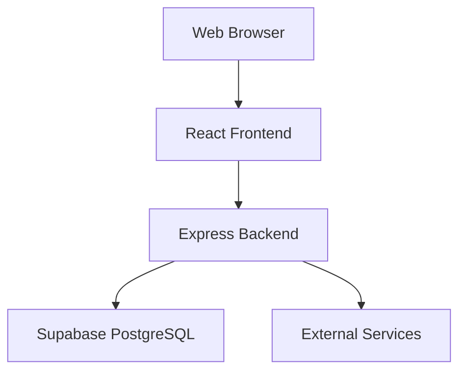

# System Architecture

## 1. Architecture Style

The Real Estate Platform uses a modular-monolith architecture.

The frontend and backend are separate applications, while the backend is deployed as one application containing clearly separated business modules.

## 2. High-Level Architecture

