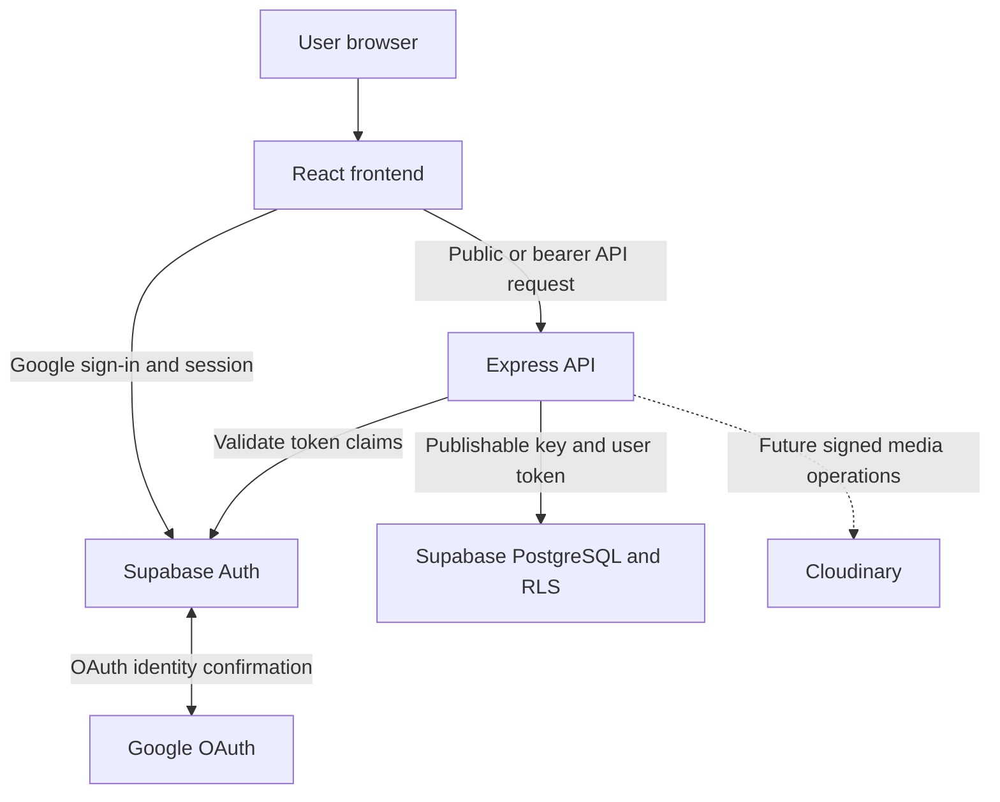

# System Architecture

## 1. Architecture Style

The Real Estate Platform uses a modular-monolith architecture.

The React frontend and Express backend are separate applications. The backend
is deployed as one application containing clearly separated route, middleware,
controller and service modules.

Supabase provides managed authentication and PostgreSQL. PostgreSQL permissions
and Row Level Security remain part of the application security boundary.

## 2. High-Level Architecture



Cloudinary is an approved future integration but is not active in the current
authentication implementation.

## 3. Component Responsibilities

| Component           | Responsibility                                                                               |
| ------------------- | -------------------------------------------------------------------------------------------- |
| User browser        | Runs the React application and holds the current user session                                |
| React frontend      | Renders public and protected interfaces and sends API requests                               |
| Google OAuth        | Confirms the Google account identity without sharing the Google password with the platform   |
| Supabase Auth       | Coordinates OAuth, issues sessions and validates access-token claims                         |
| Express API         | Applies validation, authentication, account-status checks, role checks and controlled errors |
| Supabase PostgreSQL | Stores profiles, roles and property data and enforces database constraints and RLS           |
| Cloudinary          | Will store approved property media after signed-upload integration is implemented            |

The browser is an untrusted client. Frontend routing and conditional rendering
improve usability but are not authorization controls.

## 4. Request Paths

### 4.1 Public Catalogue Request

Anonymous visitors do not need an account to browse the public catalogue.

The public request path is:

1. React sends a request to the Express public catalogue API.
2. Express validates query or route parameters.
3. Express queries Supabase using the publishable-key client.
4. Public PostgreSQL policies expose only published and verified records.
5. Express returns a privacy-preserving response.

Exact locations, private provider data, unpublished listings and unapproved
media must remain absent from public responses.

### 4.2 Google OAuth Request

The Google OAuth path is:

1. The user selects the seeker or provider journey in React.
2. React stores the registration intent in browser session storage.
3. React asks Supabase Auth to begin Google OAuth.
4. Google handles the Google email and password interaction.
5. Google redirects to the Supabase Auth callback.
6. Supabase redirects to the approved React callback route.
7. React receives the Supabase session.
8. Provider intent triggers the narrowly scoped provider-enrolment endpoint.
9. The provider workspace loads only after backend authorization succeeds.

Registration intent controls workflow only. It is not an authorization source.

Google confirms identity. The platform database remains authoritative for
account status, roles, provider access, verification and publication.

### 4.3 Authenticated API Request

The protected request path is:

1. React sends `Authorization: Bearer <access-token>` to Express.
2. Express rejects a missing or malformed bearer header.
3. Supabase Auth validates the token claims.
4. Express validates the token subject as a UUID.
5. Express creates a request-scoped Supabase client using the publishable key
   and validated user token.
6. Express reads the matching profile and roles.
7. Express rejects a missing, suspended or otherwise inactive profile.
8. Endpoint-specific middleware checks the required database role.
9. PostgreSQL permissions and RLS evaluate the authenticated user.
10. Express returns a controlled response.

The access token must never be logged, placed in a URL or returned in an API
response.

## 5. Trust and Security Boundaries

### 5.1 Authentication

Authentication answers: **Who is this user?**

Google verifies the Google account identity. Supabase Auth issues and validates
the application session. Express accepts the identity only after validating the
Supabase access token.

The application never receives the user’s Google password.

### 5.2 Authorization

Authorization answers: **What may this authenticated user do?**

Authorization uses:

- The UUID from the validated token
- The matching active profile
- Roles stored in the database
- Endpoint-specific middleware
- PostgreSQL permissions
- Row Level Security

Authorization must not use:

- A UUID supplied by the frontend
- A role supplied by the frontend
- Client-editable authentication metadata
- A hidden frontend route
- Frontend conditional rendering alone
- An email address by itself

### 5.3 Verification and Publication

Authentication, provider authorization, provider verification, property
verification and publication are separate controls.

The `property_provider` role permits access to provider features. It does not
verify the provider or authorize publication.

Only approved administrator operations may verify or publish listings.

## 6. Implemented Middleware Chains

| Endpoint                               | Middleware order after route mounting                                                        |
| -------------------------------------- | -------------------------------------------------------------------------------------------- |
| `GET /api/v1/auth/me`                  | General API limiter, account API limiter, bearer authentication                              |
| `POST /api/v1/auth/provider-enrolment` | General API limiter, account API limiter, enrolment limiter, bearer authentication           |
| `GET /api/v1/provider/workspace`       | General API limiter, account API limiter, bearer authentication, provider-role authorization |

Authentication runs before provider-role authorization. Therefore, role checks
never rely on an unvalidated frontend claim.

## 7. Database Enforcement

The authenticated backend client contains:

- The Supabase project URL
- The Supabase publishable key
- The validated user’s bearer token
- Stateless authentication options

The user token allows PostgreSQL RLS to evaluate the caller’s authenticated
UUID.

Provider enrolment calls:

```text
public.enrol_current_user_as_provider()
```
Provider enrolment succeeds only when the caller's profile has
`account_status = 'active'`. Every other account status is rejected before
the provider role can be inserted.

The function accepts no UUID or role arguments. It can add only the
`property_provider` role to the authenticated caller and is safe to repeat.

Future provider property-management endpoints must derive ownership from the
authenticated UUID and database relationships. They must not trust ownership
identifiers submitted by the browser.

## 8. Key and Secret Rules

The following values may be used by the frontend:

- Supabase project URL
- Supabase publishable key
- Public Express API URL

The following values must never be included in frontend code or committed to
the repository:

- Supabase service-role key
- Google OAuth client secret
- Cloudinary API secret
- Database password
- User access tokens
- Production credentials

The backend uses the Supabase publishable key plus the validated user’s bearer
token for ordinary authenticated operations. It does not use a service-role key
for those requests.

## 9. Abuse Protection and Controlled Errors

The API applies IP-scoped rate limits:

- 300 requests per 15 minutes across `/api/v1`
- 60 requests per 15 minutes across account API routes
- 10 requests per 15 minutes for provider enrolment

Protected endpoints return controlled `401`, `403`, `429` and `500` responses.

Internal stack traces, database messages and token details are not returned to
the browser.

The exact endpoint, response and error contracts are documented in the
[Authentication and Provider Access API](../api/authentication-api.md).

## 10. Local OAuth Configuration

The verified local frontend origin is:

```text
http://localhost:5173
```

The verified React callback is:

```text
http://localhost:5173/auth/callback
```

The Google OAuth redirect URI points to the Supabase Auth callback:

```text
https://<supabase-project-ref>.supabase.co/auth/v1/callback
```

Vite uses port `5173` with strict-port enforcement. This prevents the local
server from silently moving to an origin absent from the OAuth allow list.

Google OAuth currently uses an external audience in Testing mode. Only approved
test users may complete the flow.

Production URLs must be reviewed before changing Supabase or Google OAuth
configuration.

## 11. Current Implementation Boundary

Implemented:

- Anonymous public catalogue access
- Google OAuth through Supabase Auth
- Frontend session lifecycle handling
- Current-account API
- Automatic provider enrolment
- Active-account enforcement
- Database-authoritative provider-role enforcement
- Protected provider workspace foundation
- Authentication-specific rate limiting
- Controlled authentication errors
- Sign-out confirmation, completion feedback and session-expiry handling

Not yet implemented:

- Provider-owned property drafts
- Provider listing editing and submission
- Signed Cloudinary uploads
- Administrator review API
- In-application administrator dashboard
- Production OAuth URLs
- Booking and payments

## 12. Related Documentation

- [ADR-010: Self-Service Provider Authentication and Authorization](./decisions/ADR-010-self-service-provider-authentication-and-authorization.md)
- [Authentication and Provider Access API](../api/authentication-api.md)
- [Public Property Catalogue API](../api/public-catalog-api.md)
- [Data Retention and Erasure](../security/data-retention-and-erasure.md)
