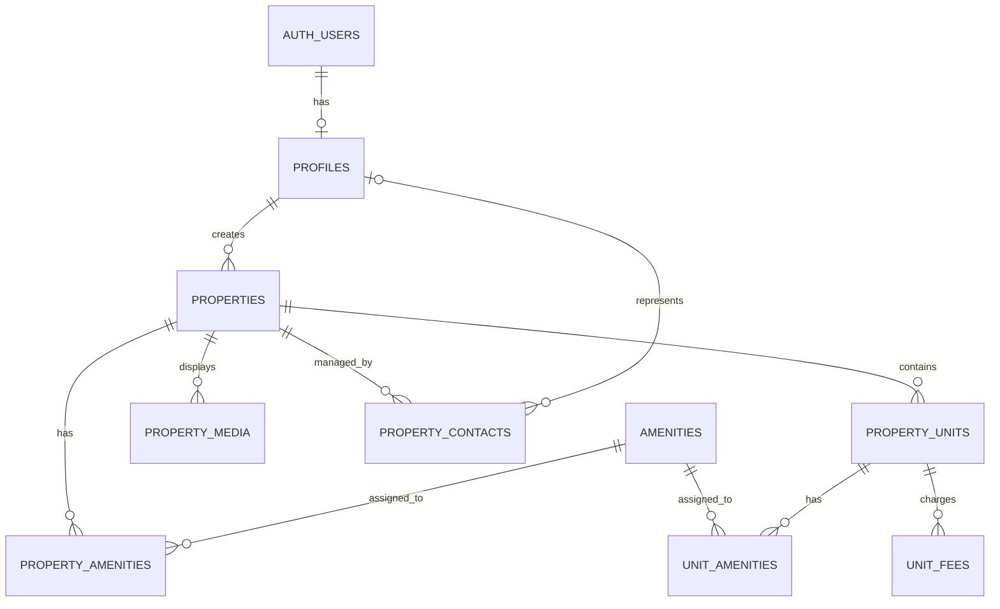
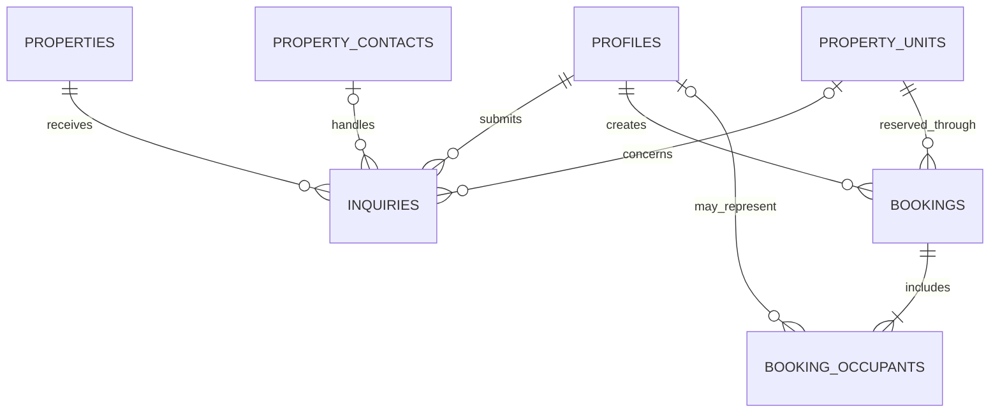
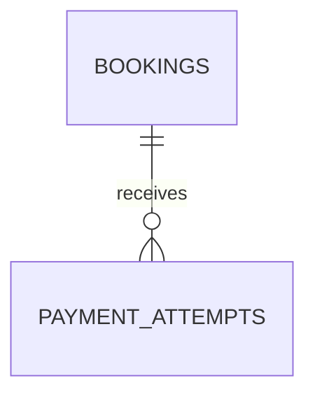

# Entity-Relationship Diagram

## Purpose

This document defines the Phase 1 database entities and their relationships before SQL migrations are written.

## Core Design Principle

A property and a listing are different records.

```text
Property = physical building
Property unit = rentable part of the building
Listing = current commercial offer for a unit\

```

# Entity Relationship Diagram

## Project

Real Estate Platform

## Purpose

This document visually describes the database entities and their relationships before SQL implementation.

## Property Catalogue Relationships



## Customer Workflow Relationships



## Payment Boundary

Payment entities are intentionally excluded from the current MVP design.

They will later connect to bookings without changing the existing relationships:


